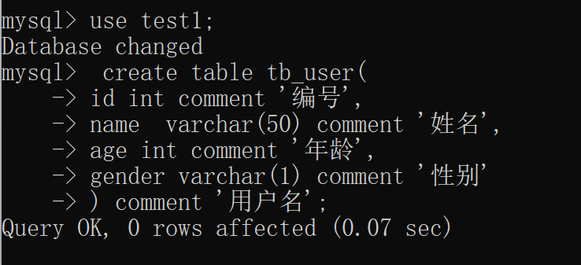
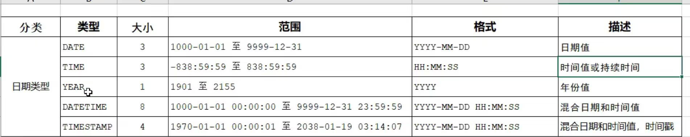
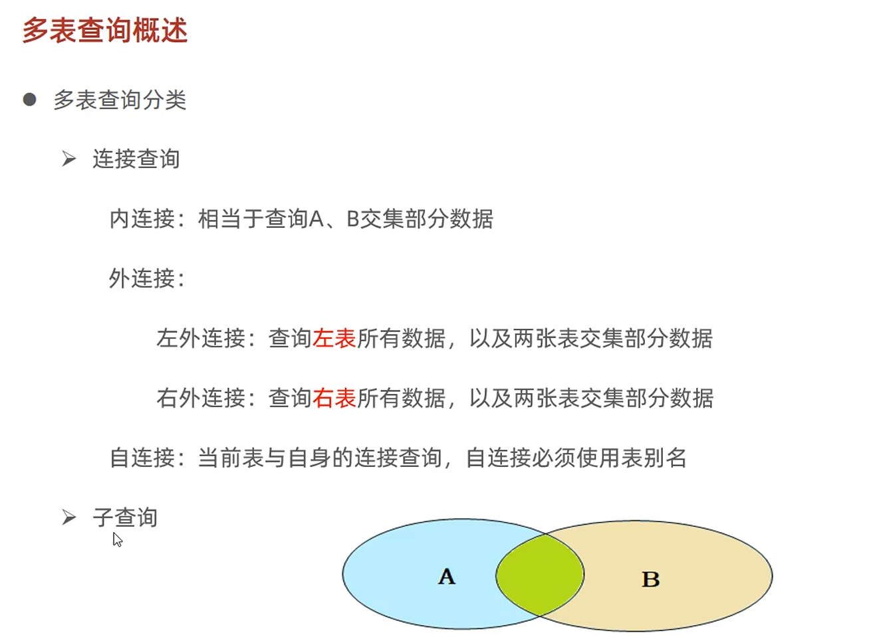

[TOC]

# SQL语法

 

## DDL

### 命令

查询所有数据库 ： show databases;

查询当前数据库： select database();

创建： create database [if not exists] 数据库名 [default charset 字符集] [collate 排序规则];

删除：drop database [if exists] 数据库名;

使用： use 数据库名;


## SQL

查询当前数据库中的所有表： show tables;

查询表结构： desc 表名；

查询指定表的键表语句： show  create table 表名;





### 数据类型

* 数值类型：

tinyint  ,  smallint ,  mediumint , int/integer , bigint , float , double , decimal 


double (4,1) ; 表示多少长度：100.0 （4），1表示多少位小数


* 字符串类型：

  char (定长), varchar (变长) , tinyblob , blob , text , mediumblob , mediumtext , ,longblob , longtext

   

  char(10)  ,  varchar(10) ,最多已经限制了


* 日期类型：

​	


### 命令

* 表头的增： alter table 表明 add 要增加的名 varchar (20) comment ' 昵称';

* 表头的改：
  * 修改数据类型：alter table tb_user modify nickname varchar(30) comment '用户名';
  * 修改字段名和子段类型：alter table tb_user change nickname username varchar(30) comment '用户名';
* 表内容的删： alter table tb_user drop username;

* 修改表名：alter table 表名 rename to 新表名; 
* 表的删除：
  * 删除表：  drop table [if exists] 表名;
  * 删除指定表，并重新创建该表： truncate 表名;p


## DML(增删改)

增加，如果不写字段，默认全部

```mysql
insert into 表名 (字段1，字段2，...) values (值1，值2),(值1，值2);
```


```mysql
insert into user (id, name, age) values (001,'Vanilla',18),
                                        (002,'Mlt',19);

select *from user;//查询返回

update user set name ='a' where id=2;//修改
update user set name='b',age=20 where id=1;

insert into user values (003,'Vanilla',19),(004,'Vanilla_xi',20)//添加
,(005,'c',21);

update user set age =23 ;

delete from user where id=1;//删除
```


## DQL

select

条件查询

```mysql
select name as '称呼' from user;/*(起别名)*/
select distinct age as '年龄' from user;/*去重*/

select * from user where age!=10 &&id=1;
select * from user where age in(10,11,20);/*只需满足其一*/

select *from user where age<=10;
select *from user where id is null;
select *from user where id is not null;

select *from user where name like '__'; #每个下划线代表一个字符
select *from user where name like '%X';# % 代表任意，可以是多个字符

```


聚合函数

```mysql
select count(*) from user;# 整张表数据
select count(id) from user; #id有值

select avg(age) from user;# 平均值
select max(age) from user; #max
select sum(age) from user where age=5;
```


分组查询

```mysql
##分组前过滤
select gender,count(*) from user group by gender;
select gender,avg(age) from user group by gender;

##分组后过滤
select name, count(*)from user where age>18 group by gender having count(*)>=3;
```


排序查询

```mysql
##排序查询
select *from user order by age;
select *from user order by age desc; #降序
select *from user order by age asc ,id desc; # 多排序
```


分页查询：limit 在以上方法的最后写

```mysql
#查询第1页，每页展示10条记录,起始页=前面已经有多少条记录
select *from user limit 0,10;       
select *from user limit 10,10;
```


## DCL

用户管理

```mysql
use mysql;
create user 'Vanilla'@'localhost' identified by '123456'; #当前主机访问
create user 'Vanilla1'@'%' identified by '123456'; #任意主机访问
alter user 'Vanilla'@'localhost' identified with mysql_native_password by '12345'; #改密码
drop user 'Vanilla'@'localhost'; ##删除用户
```


权限控制

```mysql
-- 查询权限
show grants for 'Vanilla'@'%';

-- 授予权限 数据库名.表名
grant all on mysql.* to 'Vanilla1'@'%';

-- 撤销
revoke all on test1.* from 'Vanilla1'@'%';
```


# 函数

字符串函数

```mysql
select concat('hello','My');-- 拼接
select upper('abc');
select lpad('01',5,'-');-- 左填充
select rpad('01',5,'-');

select trim('Hello Mysql ');-- 去除头尾的空格
select substring('Hello Mysql',1,5);-- 截取，从哪里开始，截取多少个

```


数值函数

```mysql
select ceil(1.5);
select floor(1.5);
select mod(3,4); -- 3%4
select rand(); -- 0~1
select round(2.345,2); -- 保留两位小数，四舍五入
```


日期函数

```mysql
select curdate(); -- 当前日期
select curtime();
select now();
select year(now());
select month(now());
select day(now());
select date_add(now(),interval 70 day);-- 往后推
select datediff('2020-01-07','2020-01-02');-- 相差多少天
```


流程函数

```mysql
select if(true,'OK','Error');
select ifnull('OK','Default');-- 第一个值为null,就返回第二个，否则返回本身
```


```mysql
select
    id,
    (case name when '北京' then '一线' when '上海' then '一线' else '其他城市' end ) as '工作地址'
from user;
```


# 约束

```mysql
create table user2(
    id int primary key auto_increment comment'主键',-- 主键，自动增长
    name varchar (10) not null unique comment'姓名',
    age int check(age>0&&age<=120) comment '年龄',
    status char(1) default '1' comment '状态', -- 默认为1
    gender char(1) comment '性别'
)comment '用户表';
```


```mysql
-- 给user 建立外键 与dept 关联
alter table user add constraint fk_user_dept_id foreign key (dept_id) references dept(id);

-- 删除
alter table user drop foreign key fk_user_dept_id;

-- 级联
alter table user add constraint fk_user_dept_id foreign key (dept_id) references dept(id) on update cascade on delete cascade ;

alter table user add constraint fk_user_dept_id foreign key (dept_id) references dept(id) on update set null on delete set null ;

```


# 多表查询

```mysql
-- 隐式内连接
select *from emp,dept where emp.dept_id=dept.id;
select *from emp e,dept d where e.dept_id=d.id;

-- 显式内连接
select * from emp inner join dept on emp_id=id;
```




```mysql
-- 左外右外
select 字段列表 from 表1 left [outer] join 表2 条件;
select 字段列表 from 表1 right [outer] join 表2 条件;
```


## 联合查询

```mysql
-- 联合查询
select *from emp where salary<5000
union all-- 不去重，无all 去重
select *from emp where age>50;
```


## 子查询

列子查询

```mysql
-- 子查询
select * from emp where dept_id =(select id from dept where name='销售部');

-- 比所有人高
select * from emp where salary > all (select salary from emp where dept_id=(select id from dept where name='财务部'));

-- 比任意一人高
select * from emp where salary > any (select salary from emp where dept_id=(select id from dept where name='财务部'));

```


行子查询

```mysql
select * from emp where (salary,managerid)=(select salary,managerid from emp where name='Vanilla');
```


表子查询

```mysql
select job,salary from emp where name='Vanilla'or name='Mlt';
select *from emp where (job,salary) in (select job,salary from emp where name='Vanilla'or name='Mlt');

```


```mysql
select * from emp where entrydate = '2006-01-01';
select d.*,e.* from (select * from emp where entrydate > '2006-01-01') e left join dept d on e.dept_id=d.id; -- null的也要查,on 哪里是两张表的连接
```


# 事务


```mysql
-- 手动操作
select @@autocommit; 
select * from account where name ='Vanilla';
update account set money =money-1000 where name='Vanilla';
update account set money =money+1000 where name='Mlttt';
commit; -- 提交

-- 回滚事务
rollback;

-- 开启事务
start transaction ;
```


## 四大特性

* 原子性
* 一致性
* 隔离性
* 持久性


并发事务问题：

1. 脏读：一个事务读取到另一个事务还没提交的数据
2. 不可重复读：一个事务先后读取同一条记录，但两次读取的数据不同
3. 幻读：一个事务在按照条件查询数据时，没有对应的数据行，但在插入数据时，又发现这行数据存在


