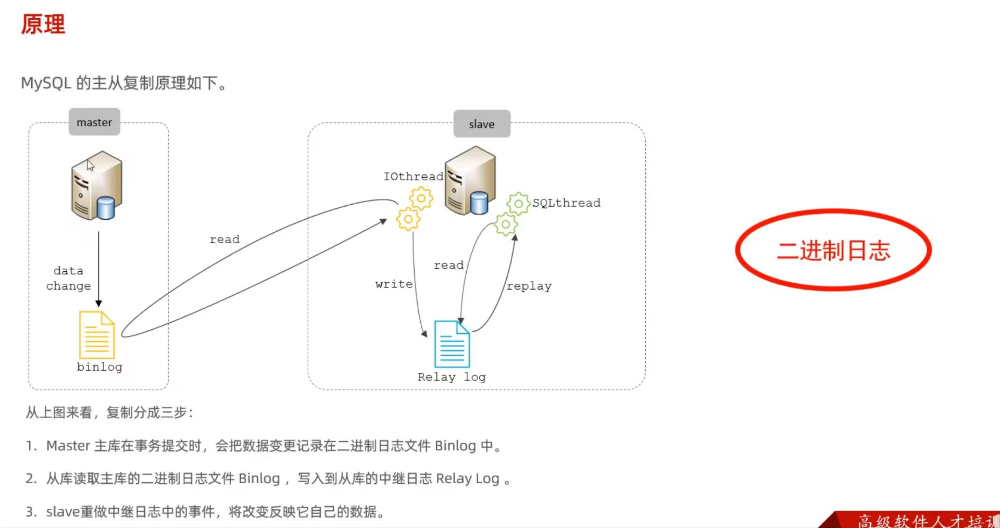

[TOC]

# 日志

## 注意


| 日志类型                         | 作用                     |
| -------------------------------- | ------------------------ |
| **Redo Log（重做日志）**         | 保证事务持久性，崩溃恢复 |
| **Undo Log（回滚日志）**         | 事务回滚 + MVCC          |
| **Binlog（二进制日志）**         | 数据复制 + 数据恢复      |
| **Slow Query Log（慢查询日志）** | 性能优化                 |


事务提交时：

1 修改数据页
2 写 Undo Log
3 写 Redo Log
4 写 Binlog
5 提交事务


Redo Log   -> 崩溃恢复
Undo Log   -> 回滚 + MVCC
Binlog     -> 主从复制
Slow Log   -> SQL优化


## 重做日志

**问题：**

事务提交
   ↓
数据还没写入磁盘
   ↓
服务器宕机


**工作原理：**

修改数据
   ↓
先写 Redo Log
   ↓
再写数据页到磁盘


## 回滚日志

1. 事务回滚

```mysql
BEGIN;

UPDATE user SET balance = balance - 100;

ROLLBACK;
```


2.  MVCC（多版本并发控制）

   MVCC 是 MySQL 实现 **高并发读写** 的关键。

   

   ```
   每次更新时：
   旧版本数据
   ↓
   存入 Undo Log
   ↓
   生成新版本
   
   查询时：
   事务A 看到旧版本
   事务B 看到新版本
   ```

   

读不阻塞写
写不阻塞读


## 错误日志

```mysql
show variables like '%log_error%';
```

找错


## 二进制日志

```mysql
show variables like '%log_bin%';
```


1. 主从复制

```
主库写 Binlog
      ↓
从库读取 Binlog
      ↓
执行 SQL
```


2. 数据恢复

误删：

```mysql
DELETE FROM user;
```


可以通过 **binlog + 时间点恢复**：

| 格式      | 含义       |
| --------- | ---------- |
| STATEMENT | 记录 SQL   |
| ROW       | 记录行变化 |
| MIXED     | 混合模式   |

现在一般用row


## 查询日志

记录了客户端的所有操作语句，而二进制日志不包含查询数据的SQL语句

```mysql
-- 查询
show variables like '%general%';

-- 开启设置
general_log=1;
```


## 慢查询日志

```mysql
#开启
slow_query_log=1;
#执行参数
loong_query_time=2;
#记录执行较慢的管理语句
log_slow_admin_statements=1;
#记录执行较慢的未使用索引的语句
log_queries_not_using_indexes=1;
```


# 主从复制

* 主库出现问题，快速切换到从库
* 实现读写分离，降低主库的访问压力
* 可以在从库中备份





# 分库分表

## 单库瓶颈

1. 连接数限制，（连接耗尽，查询变慢）
2. 磁盘io限制
3. CPU/锁竞争


## 垂直拆分

**垂直分库：**

以表为依据，根据业务不同将不同表拆分到不同库中

特点：

1. 每个库的表结构，数据都不同；

2. 所有库的并集时全量数据

   

**垂直分表：**

以字段为依据，根据字段属性将不同字段拆分到不同表中

特点：

1. 每个表的结构，数据都不一样
2. 一般通过一列（主键/外键）关联
3. 所有表的并集是全量数据


## 水平拆分

**水平分库：**

以字段为依据，按照一定策略将一个库的数据拆分到多个库中

特点：

1. 每个库的结构，数据都不一样
2. 所有库的并集是全量数据


**水平分表：**

以字段为依据，按照一定策略将一个表的数据拆分到多个表中

特点：

1. 每个表的结构，数据都不一样
2. 所有表的并集是全量数据


# 读写分离

 1️⃣ MySQL 通过 **主从复制** 实现数据同步
 2️⃣ 写操作走主库，读操作走从库
 3️⃣ 主从复制通过 **binlog** 同步数据
 4️⃣ 读写分离可以通过

- 应用层
- 数据库中间件
- 代理层

实现

5️⃣ 需要注意 **主从延迟问题**


**写操作走主库，读操作走从库**，通过主从复制保证数据同步

```
        Master（主库）
           │
      binlog复制
           │
   ┌─────────────┐
   │             │
Slave1         Slave2
（从库）        （从库）


写操作 → 主库
读操作 → 从库
```


## 核心原理

读写分离的前提是 **主从复制**。

复制过程依赖 **binlog（二进制日志）**。

```
1 主库执行SQL
2 写入binlog
3 从库IO线程读取binlog
4 写入relay log
5 SQL线程执行relay log

Master
  │
  │ binlog
  ↓
Slave IO线程
  │
  ↓
Relay Log
  │
  ↓
Slave SQL线程执行
```


## 缺陷

主从延迟

```
写入主库
↓
从库同步延迟
↓
读不到最新数据
```


**解决：**

1. 强制读主库
2. 延迟读取
3. 半同步复制


