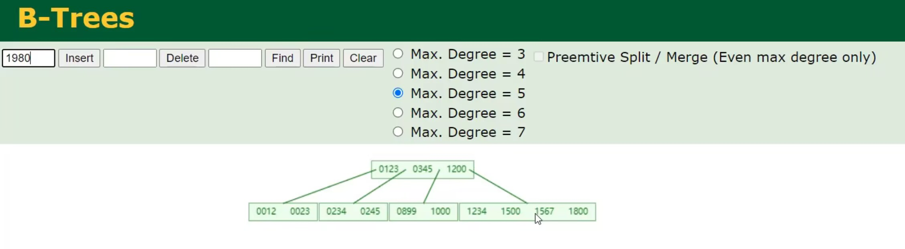
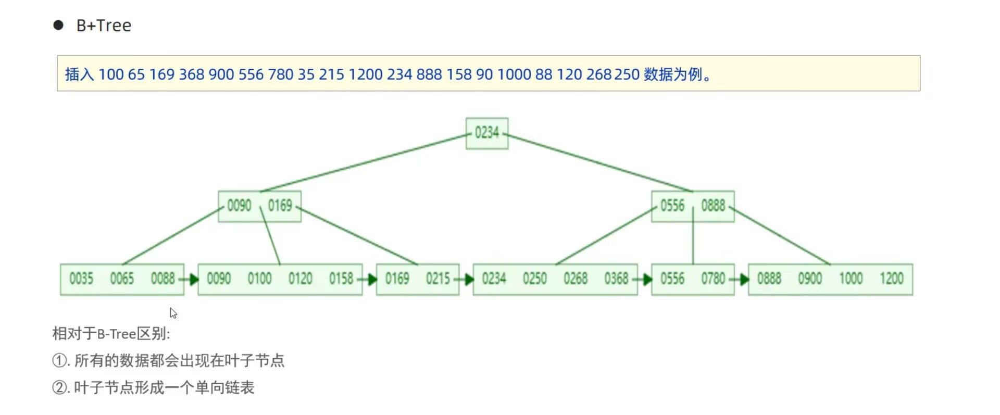
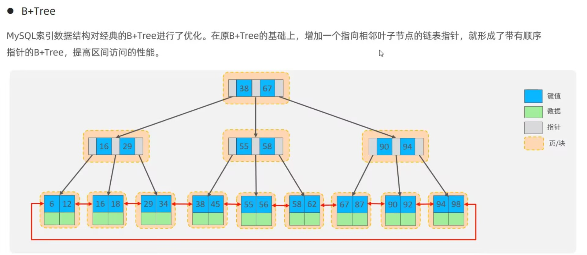
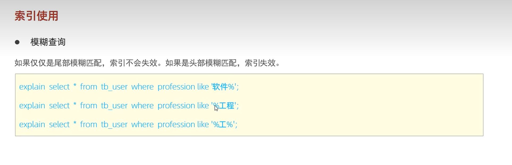
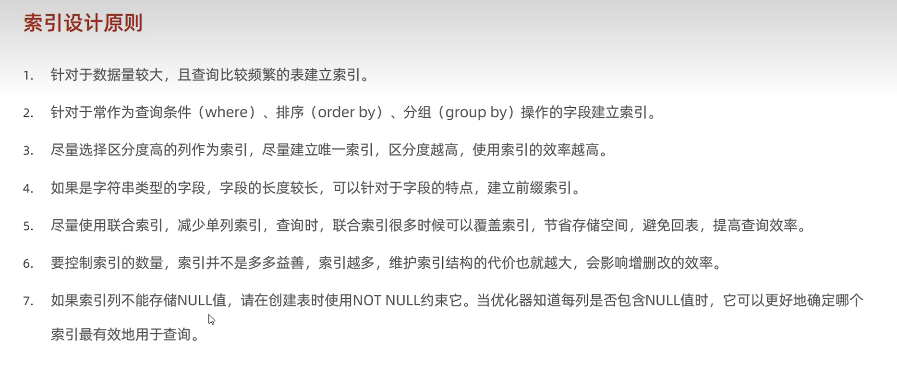
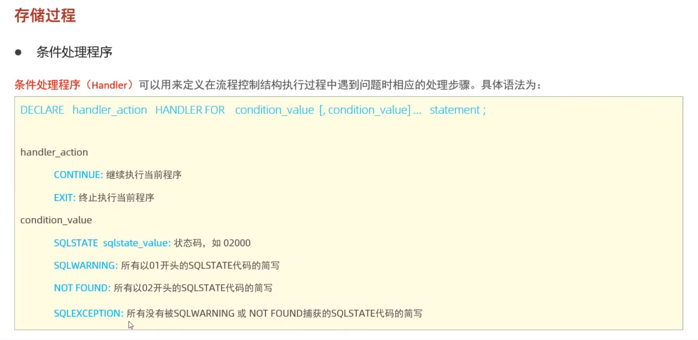

# 存储引擎

```mysql
creat table user{
	...
}engine = innodb; -- 默认，不用写
```


innldb (首选),  myisam , memory ,


# 索引

使用B+Tree

## 数据结构

### B-Tree


当当前节点 > 5 ，中间元素向上分裂，其他分为两半




### B + tree



* 叶子节点和非叶子节点都存储数据





* 数据的存储在叶子节点中，非叶子节点仅起到索引的作用


### Hash

* 仅支持等值匹配，不支持范围匹配


## 失效

### 函数导致失效

```mysql
SELECT * FROM user WHERE name LIKE '%Tom';
```


```mysql
SELECT * FROM user
WHERE YEAR(create_time)=2024;

-- 修改
WHERE create_time >= '2024-01-01'
AND create_time < '2025-01-01'
```


### 模糊查询



### or连接

用or连接的条件，如果前面的条件有索引，后面的没有，那么这两个都不会用到索引


### 数据分布影响

如果走索引比走全表扫描慢，那么就会走全表扫描


## 查看执行计划

```mysql
explain select * from user where id=1;
```


## 设计原则




## 使用

```mysql
-- 建索引， idx_表名_索引名
create unique index  idx_user_name on user(name);

-- 查索引
show index from user;

-- 删索引
drop index  idx_user_name on user(name);

-- 联合索引
CREATE INDEX idx_name_age ON user(name, age);
-- 这个可以在这里使用
SELECT * FROM user WHERE name-'Tom';
SELECT * FROM user WHERE name='Tom' AND age=20;
-- 但不能这样，因为索引先会进去name(最左前缀原则)
SELECT * FROM user WHERE age=20;


```


重点关注

| 字段  | 含义       |
| ----- | ---------- |
| type  | 访问类型   |
| key   | 使用的索引 |
| rows  | 扫描行数   |
| Extra | 额外操作   |


# 优化

## 指南

* using index : 走索引，覆盖索引 ，  using filesort : 没走索引; using temporary : 用了临时表（常出现在group by)


我们要自己建索引

```mysql
CREATE INDEX idx_name ON user(name);
```


## 插入数据

* 批量插入
* 手动设置
* 主键顺序插入


```mysql
start transaction;
insert into user values ();
insert into user values ();
insert into user values ();
insert into user values ();
commit;
```


## limit优化

```mysql
select * from user ,(select id from user order by id limit 500,10) a where s.id=a.id;

```


```mysql
SELECT * FROM order
WHERE id > 100000
LIMIT 10;
```


## join 优化

小表驱动大表，两表都有索引

```mysql
SELECT *
FROM order o
JOIN user u
ON o.user_id = u.id
```


## 慢查询日志

```mysql
show variables like 'slow_query_log'; -- 查询

set global slow_query_log =on; -- 开启
set global long_query_time = 0.5; -- 大于0.5秒的就会被记录
set global log_queries_not_using_index = on; -- 没用索引的也记录
```


# 视图

```mysql
-- 创建视图
create or replace view user_view as select id,name from  user where id<=10 with cascaded check option;

-- 查询
show create view user_view;
select * from user_view where id<3;

--  修改
create or replace view user_view as select id,name ,age from user where id<=10;

-- 删除
drop view if exists user_view;

-- 插入
insert into user_view values(...); -- 其实是插入了原始的表中，用上了with 就可以同步，并且会跟id<=20检查，可以创建视图的视图，cascaded 会检查（满足所有条件，哪里加了cascaded就得满足哪里及其父辈祖辈，而with local check option仅仅会检查自己的）
```


# 存储过程

```mysql
-- 创建
create procedure p1()
begin
    select count(*) from user;
end;

-- 调用
call p1();

-- 查看
select * from information_schema.routines where routine_schema ='user';
show create procedure p1;

-- 删除
drop procedure if exists p1;
```


## 变量

### 系统变量和会话变量

```mysql
-- 查看系统变量
show variables;
show session variables like 'auto%'; -- auto 开头,session是查看当前会话的，而非全局

select @@autocommit; -- 查看指定的


-- 设置系统变量
set session autocommit =0; -- 会话级别的
set global autocommit =0; -- 全局级别的
```


### 用户自定义变量

```mysql
-- 赋值
set @myname := 'Vanilla_xi',@myage:=10;
select count(*) into @mycount from user;
```


### 局部变量

```mysql
create procedure p2()
begin 
    declare stu_cnt int default 0;
    select count(*) into stu_cnt from user;
end;
```


## 语法

不含参

```mysql
create procedure p2()
begin
    declare score int default 58;
    declare result varchar(10);
    
    if score>=80 then
        set result:='优秀';
    elseif score >=60 then
        set result :='及格';
    else
        set result:='不及格';
    end if;
    
    select result;
    
end;
```


含参

```mysql
create procedure p3(in score int,out result varchar(10))
begin
    if score>=80 then
        set result:='优秀';
    elseif score >=60 then
        set result :='及格';
    else
        set result:='不及格';
    end if;
end;

call p3(68,@result);
select @result;
```


```mysql
create procedure p4(inout score double)
begin
    set score:=score*0.5;
end;
```


case

```mysql
create procedure p5(in month int)
begin
    declare result varchar(10);
    
    case
        when month >=1 and month<=3 then
            set result:='第一季度';
        when month >=4 and month<=6 then
            set result:='第二季度';
        when month >=7 and month<=9 then
            set result:='第三季度';
        when month >=10 and month<=12 then
            set result:='第四季度';    
        else
            set result :='非法参数';
    end case;
    
    select concat('您输入的月份所属的季度为：',result,'。');
end;
```


while

```mysql
create procedure p6(in n int)
begin
    declare a int default 0;
    while n>0 do
        set a:=a+n;
        set n:=n-1;
        end while;
    
    select a;
end;
```


repeat(相当于cpp里的 do-while)

```mysql
create procedure p7(in n int)
begin
    declare a int default 0;
    
    repeat
        set a:=a+n;
        set n:=n-1;
    until  n<=0
    end repeat;

end;
```


loop

```mysql
create procedure p8(in n int)
begin
    declare a int default 0;

    sum: loop
        if n<=0 then
            leave sum;
        end if;
        
        if n%2=1 then
        	iterate -- 相当于cpp里的continue;
        end if;	
        
        set a:=a+n;
        set n:=n-1;
        
    end loop sum;
    
end;
```


游标 cursor

```mysql
create procedure p13(in uage int)
begin
    declare uname varchar(100);
    declare uid int;
    declare u_cursor cursor for select name,id from user where age<=uage; -- 建游标，就像一张新表
    declare exit handler for sqlstate '02000' close u_cursor; -- 不加这一行后报错的第一个数据

    -- 创建一张新表
    drop table if exists  user_new;
    create table if not exists user_new(
      id int,
      name varchar(100)
    );

    open u_cursor;
    while true do
        fetch u_cursor into uname,uid; -- 游标赋值给这两个变量，游标会自己滚动到下一个
        insert into user_new values(uid,uname);
        end while;
    close u_cursor;

end;
```





# 存储函数

characteristic:

* deterministic: 相同的输入参数总是产生相同的结果
* no sql : 不含sql语句
* reads sql data : 包含读取数据的语句，但不含写入数据的语句

```mysql
create function  fun1(n int)
returns int deterministic 
begin 
    declare total int default 0;
    
    while n>0 do
        set total :=total +n;
        set n:=n-1;
        end while;
end;

select fun1(100);
```


# 触发器

## 自动更新时间段

```mysql
CREATE TRIGGER update_user_time
BEFORE UPDATE ON user
FOR EACH ROW
SET NEW.update_time = NOW();
```


## 记录数据修改

```mysql
CREATE TRIGGER log_user_update
AFTER UPDATE ON user
FOR EACH ROW
INSERT INTO user_log(user_id, action_time)
VALUES(NEW.id, NOW());
```


## 防止非法操作

```mysql
CREATE TRIGGER prevent_admin_delete
BEFORE DELETE ON user
FOR EACH ROW
BEGIN
    IF OLD.role = 'admin' THEN
        SIGNAL SQLSTATE '45000'
        SET MESSAGE_TEXT = 'Cannot delete admin';
    END IF;
END;
```


## 自动同步数据

```mysql
CREATE TRIGGER update_order_count
AFTER INSERT ON orders
FOR EACH ROW
UPDATE statistics
SET order_count = order_count + 1;
```


## 数据备份

```mysql
CREATE TRIGGER backup_user
BEFORE DELETE ON user
FOR EACH ROW
INSERT INTO user_backup
VALUES(OLD.id, OLD.name);
```


```mysql
show triggers;
```


# 锁

MySQL Lock
│
├── 表级锁 (Table Lock)
│   │
│   ├── 意向锁 (Intention Lock)
│   │     ├── IS  意向共享锁
│   │     └── IX  意向排他锁
│   │
│   └── 表锁
│         ├── READ LOCK
│         └── WRITE LOCK
│
└── 行级锁 (Row Lock)
      │
      ├── S锁 (Shared Lock)(共享锁)
      │
      └── X锁 (Exclusive Lock)（排他锁）
            │
            ├── Gap Lock (锁的是范围，不是行) 

 	   |	`select * from user where id between 10 and 20 for update;`
            │
            └── Next-Key Lock   `Next-Key Lock = 行锁 + Gap Lock`（解决幻读）


**全局锁**

通过全局锁实现数据备份，锁上时，无法进行数据更新

Datagrip

```mysql
use test1;
flush tables with read lock;
```

在cmd 上输入，不要加分号

```
mysqldump -uroot -p123456 test1 > D:\Vanilla_pro\DataGrip\copy\test1.sql
```

Datagrip

```mysql
unlock tables;
```


**行锁**

```mysql
select * from user where id=1 for update;
```


**表锁**

```mysql
lock tables user write;
```


**共享锁(他人可读)**

```mysql
select * from user lock in share mode;
```


**排他锁（只能自己操作）**

```mysql
select * from user for update;
```


**死锁**

两个事务互相等待

```
T1 锁A -> 等B
T2 锁B -> 等A
```

避免：

1. 按相同顺序加锁
2. 减少锁范围
3. 尽量走索引


**意向锁**

让行锁和表锁共存

当我们加行锁时，mysql会自动在表上加意向锁

IX: 意向排他锁

IS: 意向共享锁


