[TOC]

# 基本操作

## 快捷键

1.  win+E  (打开主文件夹)
1.  ctrl+p,显示创建对象的所有属性


## 配环境变量


## cmd

打开方式：

1. win+R
2. 输入cmd


常用cmd命令：

1. 盘符名称+冒号    (盘符切换)
2. dir (查看当前路径下的内容)
3. cd目录 (进入单级目录) (cd itheima)
4. cd.. (回退到上一级目录)
5. cd目录1\目录2\\...  (进入多级目录)  (cd itheima\ JavaSE)
6. cd\ (回退到盘符目录)
7. cls(清屏)
8. exit (退出命令提示符窗口)


## 其他

项目--> 模块 --> 包 --> 类


### 内存

* 栈内存：依次调用的，局部变量，方法参数，就是存方法运行时的运行数据
* 堆内存：存放对象（new出来的东西），所有线程共享，由垃圾回收器（GC）管理
* 方法区：类信息，static,常量


### 输入输出

```java
import java.util.Scanner;//导包，找到Scanner这个类

public class Main{
    public static void main(String[] args){
        Scanner a=new Scanner(System.in); //创建对象

        int i=a.nextInt();//接收数据

        System.out.println(i);
        System.out.println("Hello"+1+2+'\n'+8);
    }
}
```


```java
public static void main(String[] args) {
        Scanner sc = new Scanner(System.in);
        Scanner sc1= new Scanner(System.in);
        Scanner sc2=new Scanner(System.in);
        Scanner sc3=new Scanner(System.in);
        
        int a = sc.nextInt();
        double b= sc1.nextDouble();
        String c=sc2.next();
        String line=sc3.nextLine();//这是第二套体系，不能与上面的混用
        
    }
```


```java
System.out.println("Hello World");//先输出再换行
System.out.print("Hello World");//输出不换行
System.out.println();//只换行
```


### 3种码

* 原码：十进制数的二进制表达式，最左边为符号位，0为正，1为负，（正数的反码/补码是其本身）
  * 利用原码对正数计算无误，但对负数有误，这时需要用反码

* 反码：负数的反码是符号位不变，其余位取反
  * 负数利用反码计算+1，得到ans的反码，得再反
* 补码：负数的补码是在其反码的基础上+1


### 数组

```java
//数组的静态初始化
int []a={1,2,3};
String []b={"a","b","c"};

System.out.println(a);//地址值
for(int i=0;i<a.length;i++){//访问数组元素
    System.out.println(a[i]);
}
```

```java
Scanner sc = new Scanner(System.in);
int n = sc.nextInt();
int []c=new int [n];
c[0]=1;
```


### Lambda表达式

```java
(参数列表) -> { 方法体 }
```


# 常用API

## String

```java
length()        // 字符串长度
charAt(i)       // 获取某个字符
substring(a,b)  // 截取字符串
equals()        // 判断相等
equalsIgnoreCase() // 忽略大小写比较
contains()      // 是否包含
startsWith()    // 是否以xxx开头
endsWith()      // 是否以xxx结尾
indexOf()       // 查找字符位置
split()         // 字符串分割
replace()       // 替换
toLowerCase()   // 转小写
toUpperCase()   // 转大写
trim()          // 去除首尾空格
```


例子

```java
String s = "hello world";

System.out.println(s.length());
System.out.println(s.substring(0,5));
System.out.println(s.contains("world"));
```


## StringBuilder(字符串拼接)

```java
append()     // 拼接
insert()     // 插入
delete()     // 删除
reverse()    // 反转
toString()   // 转为String
```


例子

```java
StringBuilder sb = new StringBuilder();

sb.append("hello");
sb.append(" ");
sb.append("world");

System.out.println(sb.toString());
```


## Math(数学工具)

```java
Math.abs()      // 绝对值
Math.max()      // 最大值
Math.min()      // 最小值
Math.sqrt()     // 开平方
Math.pow()      // 幂
Math.random()   // 随机数
Math.round()    // 四舍五入
Math.ceil()     // 向上取整
Math.floor()    // 向下取整
```


例子

```java
System.out.println(Math.max(5,10));
System.out.println(Math.random());
```


## Arrays(数组整理工具)

```java
Arrays.sort()        // 排序
Arrays.toString()    // 数组转字符串
Arrays.equals()      // 比较数组
Arrays.binarySearch()// 二分查找
Arrays.fill()        // 填充数组
```


例子

```java
int[] arr = {3,1,4,2};

Arrays.sort(arr);

System.out.println(Arrays.toString(arr));
```


## ArrayList(最常用集合)

```java
add()        // 添加元素
remove()     // 删除元素
get()        // 获取元素
set()        // 修改元素
size()       // 元素数量
contains()   // 是否包含
clear()      // 清空
```


例子

```java
ArrayList<String> list = new ArrayList<>();

list.add("Tom");
list.add("Jack");

System.out.println(list.get(0));
```


## Colletions(集合工具类)

```java
Collections.sort()     // 排序
Collections.reverse()  // 反转
Collections.shuffle()  // 随机打乱
Collections.max()      // 最大值
Collections.min()      // 最小值
```


例子

```java
Collections.sort(list);
```


## Randoms(随机数)

```java
Random r = new Random();

r.nextInt()      // 随机整数
r.nextInt(10)    // 0-9
r.nextDouble()   // 随机小数
```


例子

```java
Random r = new Random();
System.out.println(r.nextInt(100));
```


## 时间API

```java
LocalDate
LocalTime
LocalDateTime
```

例子

```java
LocalDateTime now = LocalDateTime.now();

System.out.println(now);
```


## 正则表达式

```java
matches()
split()
replaceAll()
```


例子

```java
String phone = "13812345678";

boolean ok = phone.matches("1[3-9]\\d{9}");
```


# 数据类型

## 基本数据类型

* 内存上：数据值是存储在自己的空间中，赋值给其他变量，也是赋的真实的值

**整数** 

* `123`

* 类型：
  * byte
    * -128~127
  * short
    * -32,768~32,767
  * int (10位)
    * -2,147,483,648~2,147,483,647
  * long (19位)
    * -9,223,372,036,854,775,808~9,223,372,036,854,775,807
    * 

**浮点数**

* `12.3`
* 类型：
  * flot
    * -3.401298e-38 ~ 3.402823e+38
  * double
    * -4.9000000e-324 ~ 1.797693e+308


**字符 (char)**

* `'A'`  `'我'` `'0'`   (注：内容只能有1个)

* 0~65535

  

**布尔(boolean)**

* true, false


### 包装类

包装类是引用数据类型

| 基本类型 | 包装类    |
| -------- | --------- |
| int      | Integer   |
| double   | Double    |
| float    | Float     |
| char     | Character |
| boolean  | Boolean   |
| long     | Long      |
| short    | Short     |
| byte     | Byte      |


## 引用数据类型

* 内存上：数据值是存储在其他空间中，自己空间中存储的是地址值，赋值给其他变量，赋的是地址值
* int[ ]  a
* 泛型只能写引用数据类型


**二维数组**

```c++
int [][] a=new int[n][m];
int [][] b=new int[][] {
                {1,2,3},
                {4,5,6},
                {7,8,}
        };
```


# 面向对象

* 三大特征：
  * 封装
  * 继承
  * 多态

## 静态

static  (静态成员，静态方法（写工具类用）)  都推荐用类名调用

* 静态方法只能访问静态变量和静态方法
* 非静态方法可以访问ALL
* 静态方法中没有this关键字


## 三大特征

### 封装


### 继承

* 当类跟类之间存在相同的内容，并且满足子类是父类中的一种，就可以考虑使用继承
* 子类能继承父类中的：
  * 构造方法：不能
  * 成员变量：public能，private能
  * 成员方法：public能，private不能
* 单继承：一个子类只能继承一个父类，但可以多层继承（子父爷），默认祖宗为Object,爷：间接父类，可以使用直接父类，间接父类的内容


#### 访问特点

* 成员变量的访问特点：

  * 就近原则，先在局部找，找不到再去本类，再去父类

  * 多个时

    * this调用：就近原则，局部没有就到本类找，在没有就到父类找

    * super 调用

      

* 成员方法的访问特点

  * 就近原则，跟成员变量的访问特点一致
  * 注意： supper.eat () 访问父类

  

* 方法的重写
  * 当父类的方法不能满足子类现在的需求时，需要进行方法的重写（在子类中重写写）
  * @Override 是放在重写后的方法上，可以帮助我们检测语法是否正确
  * 重写方法的名称，形参列表必须与父类中的一致
  * 子类重写父类方法时，访问权限子类必须 > = 父类 (空着不写 < protected <public)
  * 子类重写父类方法时，返回值类型子类必须 < =  父类
  * 其实我们只需要保证重写方法子类与父类的尽可能保持一致即可
  * 重写的本质是覆盖，只有被添加到虚方法表中的方法才能被重写


* 构造方法的访问特点
  * 父类中的构造方法不会被子类继承
  * 子类中的所有构造方法默认先访问父类中的无参构造，再执行自己
    * 原因：子类初始化之前，一定要调用父类构造方法，先完成父类数据空间的初始化
  * 怎样调用父类构造方法：
    * 子类构造方法的第一行语句默认都是：super()； 不写也存在，且必须在第一行


### 多态

* 同类型的对象，表现出不同的形态
* 表现形式： Fi f=new Zi();
* 多态的前提
  * 有继承关系
  * 有父类引用指向子类对象
  * 有方法重写


* 多态调用成员的特点

  * 变量调用：编译看左边，运行看左边

    ```java
     Animal a = new Dog();
     System.out.println(a.name);//会调用父类的name
    ```

  * 方法调用：编译看左边，运行看右边

    ```java
    Animal a = new Dog();
    a.show();//会调用子类的方法
    ```


## 概念

### 包

* 使用同一个包中的类时，不需要导包
* 使用java.lang包中的类时，不需要导包
* 其他情况需要导包
* 使用不同包下的同名类，全名


### 关键字与修饰符

#### final

关键字

修饰：

* 方法：不能被重写
* 类：不能被继承
* 变量：常量，只能被赋值一次
  * 基本数据类型：变量存储的数据值不能发生改变
  * 引用数据类型：变量存储的地址值不能发生改变，但内部的属性值可变


#### 权限修饰符

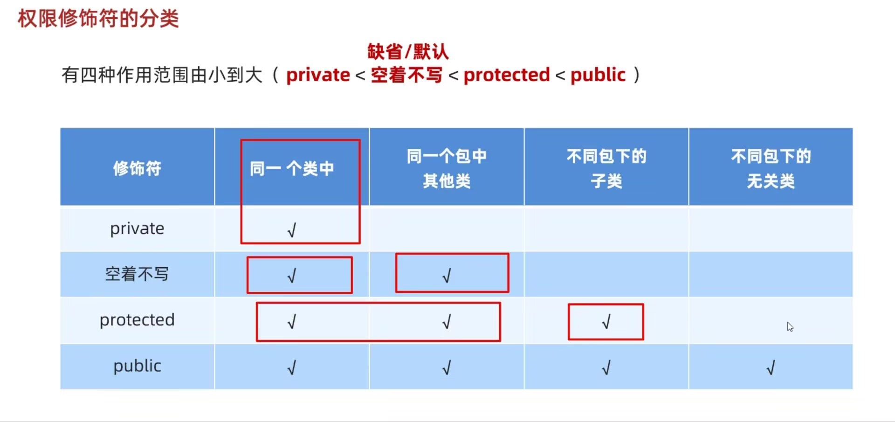


## 抽象类(多用在父类中)

多用在父类中，必有关键字 abstract，不可创建对象

补充：对于一般的类（非抽象类），我们私有化构造方法即可让它无法创建对象


**作用：**

* 抽取共性时，无法确定方法体，就把方法定义为抽象
* 强制让子类按照某种格式重写
* 抽象方法所在的类，必须是抽象类


**继承抽象类注意：**

* 要么重写抽象类中的所有抽象方法
* 要么是抽象类


## 接口(对行为的抽象)

就是一种规则，是对行为的抽象

* 实现类还可以在继承一个类的同时实现多个接口

  

**成员特点：**

* 成员变量：默认 public,static,final
* 构造方法：无
* 成员方法：只能是抽象方法，public abstract


**关系**

* 类与类：继承关系，单继承，多层继承
* 类与接口：实现关系，可在继承一个类的同时实现多个接口
* 接口与接口：继承关系，可单/多继承
  * 如果实现类实现了最下面的接口，那得全重写抽象方法


```java
package com.Vanilla.test5;

public interface Sleep {
        //抽象方法
        public void sleep();

        //默认方法不是抽象方法，所以不强制被重写
        //但如果实现多个接口同名的，强制重写
        public default void show(){
                System.out.println("接口中的默认方法------show");
                show3();
        }

        //静态方法不能被重写，只能通过接口名调用
        //但如果实现多个接口同名的，强制重写
        public static void show2(){
                System.out.println("Inter接口中的静态方法");
                show4();
        }

        //普通的私有方法，给默认方法服务
        private void show3(){
                System.out.println("记录程序在运行过程中的各种细节，这里有100行代码");
        }

        //只能给静态方法使用
        private static void show4(){
                System.out.println("记录");
        }

}
```


**适配器**

* 记得要是抽象类，不能创建对象

* 弄一个类实现某接口的所有方法（重写）
* 然后对于不同的对象（多态时），我们的各个对象未必要调用出所有的方法，因此用了适配器，我们的对象继承适配器，就不用把所有的方法都重写了，只需要重写我们要调用的方法即可

```java
package com.Vanilla.test5;

public abstract class InterAdapter implements Inter{
    @Override
    public void work1() {

    }

    @Override
    public void work2() {

    }
}
```


```java
package com.Vanilla.test5;

public class InterInpl extends InterAdapter {
    @Override
    public void work1() {
        System.out.println("只要用第1个方法");
    }
}
```


## 内部类

* 前3种不重要，此处先跳过

成员内部类：

静态内部类：

局部内部类：

匿名内部类：


### 匿名内部类

* 继承还是实现，看的是对应的是接口还是类

```java
package com.Vanilla.test7nimingInterclass;

public class Test {
    public static void main(String[] args) {
        //对象
        new Swim() {//实现关系
            //匿名内部类,实现了Swim接口,方法重写
            //而new创建了这个类的对象
            @Override
            public void swim() {
                System.out.println("重写了游泳的方法");
            }
        };
        
        new Animal(){//继承关系,继承类
            @Override
            public void eat() {
                System.out.println("重写了吃的方法");
            }
        };
    }
}
```


### 使用场景

* 编译看左边，运行看右边
* 我们要调用method时，原本要创建Animal 的多态Dog的一个对象并重写方法，但是这样未免太麻烦了，于是我们创建匿名内部类

```java
package com.Vanilla.test7nimingInterclass;

public class Test {
    public static void main(String[] args) {
        //对象
        new Swim() {//实现关系
            //匿名内部类,实现了Swim接口,方法重写
            //而new创建了这个类的对象
            @Override
            public void swim() {
                System.out.println("重写了游泳的方法");
            }
        };

        new Animal(){//继承关系
            @Override
            public void eat() {
                System.out.println("重写了吃的方法");
            }
        };


        //使用匿名内部类调用方法
        //编译看左边，运行看右边
        method(
                new Animal(){//继承关系
                    @Override
                    public void eat() {
                        System.out.println("重写了吃的方法");
                    }
                }
        );

    }

    public static void method(Animal a){
        a.eat();
    }

}
```


# 集合

## Collection(单列集合)（接口）

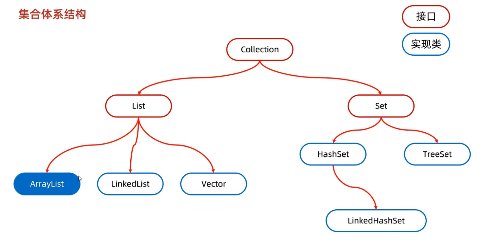


Collection是单列集合的祖宗接口，它的功能是全部单列集合都可以继承使用的


### 使用场景

1. 可重复： ArrayList 用的最多
2. 可重复，增删明显多于查询： LinkedList
3. 去重，HashSet 用的最多
4. 去重，而且保证存取顺序 ：LinkedHashSet （效率低于HashSet)
5. 排序，TreeSet


```java
 public boolean add(a) //添加
 public void clear() //清空
 public boolean remove(E) //删除
 public boolean contains(Object obj) //判断是否包含
 public boolean isEmpty() //判断是否为
 public int size() //集合长度
```


```java
		//创建一个实现Collection接口的ArrayList类的对象coll
        Collection<Students> coll=new ArrayList<>();
        coll.add("a");
        coll.clear();
        boolean a=coll.isEmpty();
        System.out.println(a);
        coll.remove("a");
        int x=coll.size();
        System.out.println(x);
```


**判断元素是否包含**

* 底层是依赖equals 方法实现的
* 所以，如果集合中存储的是自定义对象，也想通过contains方法来判断是否包含，那么在javabean类中，一定要**重写equals方法**


### 遍历

#### 迭代器遍历

* 迭代器遍历时，不能用集合的方法进行添加或删除
* 用迭代器特有的  it.remove();删除
* 但无法添加


```java
package com.Vanilla.test2;

import java.util.ArrayList;
import java.util.Collection;
import java.util.Iterator;

public class Test1 {
    public static void main(String[] args) {
        Collection<String> list = new ArrayList<>();
        list.add("a");
        list.add("b");
        list.add("c");
        list.add("d");


        //创建指针，迭代器的泛型=集合中元素的泛型,默认指向0索引处
        Iterator<String> it=list.iterator();

        while(it.hasNext()){//判断是否有元素
            String str=it.next();//获取元素并移动指针
            if(str.equals("b")){
                it.remove();
            }
        }

        System.out.println(list);
    }
}
```


#### 增强for遍历

* 所有的单列集合和数组才能用增强for遍历
* 修改增强for中的变量，不会改变集合中原本的数据

```java
for(String s: list){
     System.out.println(s);
}
```


#### Lambda表达式遍历

```java
coll.forEach( s-> System.out.println(s));
```


### 分类(继承它的接口)

#### List（接口）

添加的元素是有序（存和取的顺序一致），可重复，有索引


##### 方法

###### **添加**

```java
package com.Vanilla.list;

import java.util.ArrayList;
import java.util.List;

public class myList {
    public static void main(String[] args) {
        List<String> list=new ArrayList<>();

        list.add("a");
        list.add("b");
        list.add("c");

        list.add(1,"d");//在指定索引处添加元素
        String x=list.remove(0);//删除指定索引处的元素,返回删除的元素

    }
}
```


###### **删除**

如果出现重载现象，优先调用实参与形参相同的方法

```java
package com.Vanilla.list;

import java.util.ArrayList;
import java.util.List;

public class myList2 {
    public static void main(String[] args) {
        List<Integer> list=new ArrayList<>();

        list.add(1);
        list.add(2);
        list.add(3);

        list.remove(1);//索引，因为如果出现重载现象，优先调用实参与形参相同的方法
        list.remove("1");//Object类型，是类

        
        //手动装箱
        Integer i=Integer.valueOf(1);
        list.remove(i);//Object型
        
    }
}
```


###### **修改**

```java
String re=list.set(0,"QQQ");//返回被修改的元素
System.out.println(re);
System.out.println(list);
```


###### **获得**

```java
String s=list.get(0);//返回指定索引处的元素
```


##### 遍历

前3种继承Collection

4. 普通for遍历，用get获取元素


5. 列表迭代器

​         可添加元素

```java
package com.Vanilla.list;

import java.util.ArrayList;
import java.util.List;
import java.util.ListIterator;

public class myList {
    public static void main(String[] args) {
        List<String> list=new ArrayList<>();

        list.add("a");
        list.add("b");
        list.add("c");

        ListIterator<String> it = list.listIterator();
        while(it.hasNext()){
            String str=it.next();
            if("b".equals(str)){
                it.add("qqq");//添加
            }
            System.out.println(str);
        }

    }
}
```


##### 实现类

###### ArrayList

底层原理：

* ArrayList底层是数组结构的，利用空参创建集合，在底层创建一个默认长度为0的数组
* 添加第一个元素的时候，数组默认长度为10
* 当数组添加满了后，会自动扩容为1.5倍
* 如果一次添加多个元素，1.5倍还放不下，则新创建数组的长度以实际为准


###### LinkedList

底层原理：

* 底层数据结构是双链表，查询慢，增删块，但如果操作的是首尾元素，速度快


特有API

```java
package com.Vanilla.list;

import java.util.ArrayList;
import java.util.LinkedList;
import java.util.List;

public class myList2 {
    public static void main(String[] args) {
        List<String> list=new LinkedList<>();
        
        list.addFirst("a");
        list.addLast("b");
        String str1=list.getFirst();
        String str2=list.getLast();
        String str3= list.removeFirst();//从列表中删除并返回第一个元素
        String str4= list.removeLast();
    }
}
```


#### Set（接口）

添加的元素是无序，不重复，无索引


##### 实现类

###### HashSet（无序）

**无序**

在自定义的类中重写equals 和 HashCode 是必须的，非自定义的类java已经提供好了


**概念**

* HashSet 采取哈希表存储数据
* 哈希表：数组+链表+红黑树
* 哈希值：
  * 定义：
    * 对象的整数表现形式， **int index = (数组长度-1) & 哈希值**
    * 该方法定义在Object 类中，所有对象都可以调用，默认使用地址值进行计算
    * 但一般情况下，会**重写 hashCode 方法**，利用**对象内部的属性值**计算哈希值
  * 特点：
    * 如果没有重写hashCode，不同对象计算出的哈希值不同
    * 已经重写：不同对象只要属性值相同，计算出的哈希值会相同
    * 哈希碰撞：小部分情况下，不同属性值或不同地址值计算出来的哈希值可能是一样的


**底层原理**

1. 创建一个默认长度为16，默认加载因为0.75的数组table，加载因指的是：
   * 当数组存了16*0.75时，数组就会扩容成原先的两倍
   * 当链表长度 >8 而且数组长度 >= 64 时，当前的链表就会转为红黑树
2. 如何添加元素：先根据哈希值计算index
   * 若数组上的该位置为null,直接添加；
   * 若已经有元素了，那么调用equals方法比较属性值，一样就不存，不一样才存，形成链表（新元素挂在老元素的下面）


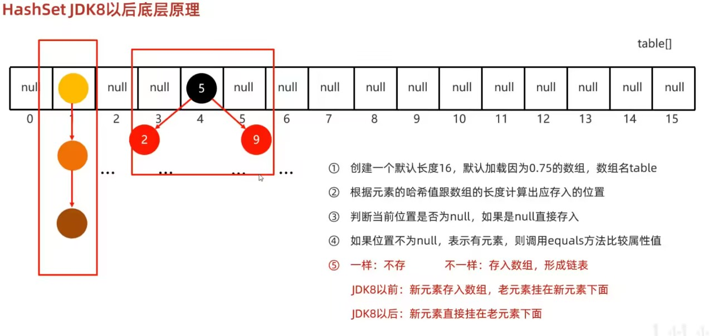


**HashSet 的三个 问题**

1. 为什么存和取的顺序不一样？

   答：存的时候，根据哈希值获取索引，遍历时从数组0索引开始，在数组的一个位置上可能有链表，红黑树

2. HashSet为什么没有索引？

   答：HashSet 底层由数组，链表，红黑树三者组成

3. Hashset是利用什么机制保证数据去重的？

   答：利用HashCode确定元素添加在数组的哪个位置，再利用 equals 去比较对象内部的属性值是否相同，因此在自定义的类中重写equals 和 HashCode 是必须的，非自定义的类java已经提供好了


###### LinkedHashSet(继承了HashSet)（有序）

**有序：**

保证存和取的顺序一致，底层依然是**哈希表**，只是每个元素右额外的多了一个**双链表**的机制记录存取的顺序，遍历的时候根据双链表来遍历


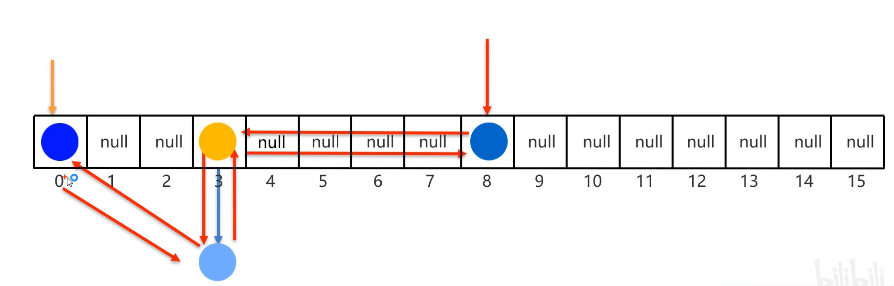


###### TreeSet (可排序)

* 默认升序，基于红黑树来实现排序，可对数字，字符，字符串排序

* 不需要重写 HashCode , equals 

  

**两种排序方式：**

*  我们默认使用第一种方式，当第一种方式不能满足需求时，才使用第二种
* 若程序里两种方式都存在，那我们以第二种为准


1. 默认排序，自定义对象时，要实现Comparable，然后重写compareTo

```java
public class Student implements Comparable <Student>{
    ...
    @Override
    public int compareTo(Student o) {
        //按年龄升序
        return this.getAge()-o.getAge();//负数存左边，正数存右边，0不存
    }    
}
```


```java
    public int compareTo(Student o) {
        int sum1=this.getChinese()+this.getMath()+this.getEnglish();
        int sum2=o.getChinese()+o.getMath()+o.getEnglish();

        int i=sum1-sum2;
        i = i==0 ? this.getChinese()-o.getChinese():i;
        i = i==0 ? this.getMath()-o.getMath():i;
        i = i==0 ? this.getEnglish()-o.getEnglish():i;
        i = i==0 ? this.getMath()-o.getMath():i;
        i = i==0 ? this.getName().compareTo(o.getName()):i;//字符串里的默认排序方式

        return i;
    }
```


2. 比较器排序：创建TreeSet对象时，传递比较器 Comparator 指定规则

```java
        //先按照长度排序
        // 如果长度相等，再按照字典顺序排序
		//o1：要添加的元素，o2:已经在红黑树中存在的元素
        TreeSet<String> ts=new TreeSet<>(new Comparator<String>(){
            @Override
            public int compare(String o1, String o2) {
                int i=o1.length()-o2.length();
                i=i==0? o1.compareTo(o2):i;
                return i;
            }
        });

		//lambda写法
        TreeSet<String> ts1=new TreeSet<>(( o1,  o2)-> {
                int i=o1.length()-o2.length();
                i=i==0? o1.compareTo(o2):i;
                return i;
        });
```


## Map(双列集合)

* 一次得一起添加键和值


```java
Map<String,String> m=new HashMap<>();
```


### 常见API

```java
m. put (key,value);
m. remove (key);
m.clear();
m. containisKey (key);
m. containsValue(value);
m.isEmpty();
int size();

Set<String> keys=map.keySet();//获得所有键值，把这些键放到一个单列集合中
```


### 实现类

#### HashMap

* 无序，不重复，无索引，和HashSet 底层原理一样，都是哈希表结构


#### LinkedHashMap

继承HashMap，有序，不重复，无索引


#### TreeMap

* 和TreeSet一样，不重复，可排序
* 默认键的 从小到大进行排序，也可以自己规定键的排序规则


```c++
    public static void main(String[] args) {
        String s = "ababaac";
        TreeMap<Character, Integer> tm = new TreeMap<>();

        for(int i=0;i<s.length();i++){
            char c=s.charAt(i);
            
            if(tm.containsKey(c)){
                int cnt=tm.get(c);
                cnt++;
            }else{
                tm.put(c,1);
            }
        }
                
        
    }
```


#### Hashtable


#### Properties


## Collections

```java
        ArrayList<String> list =new ArrayList<>();
        
        Collections.addAll(list,"a","sd");//批量添加
        Collections.shuffle(list);//打乱
```


# 数据结构

## 栈

先进后出


## 队列

先进先出


## 数组

内存连续，查询快，增删慢


## 链表

内存游离

* 由各节点组成
  * 节点包括
    * 该节点的数据值
    * 该节点的地址值
    * 下一个节点的地址值

* 查询慢，增删快

  

双链表节点还会记录前一个节点的地址值


## 树

节点记录：值，父节点及左右节点的地址值

度：每个节点的子节点数量

树高：树的总层数


### 二叉树

任意节点的度<=2


**遍历**

* 前序：当前节点，左子节点，右子节点
* 中序（最常用）：左节点，当前节点，右节点
* 后序：左节点，右节点，当前节点


### 二叉查找树

又称笛卡尔树

树的每个左子节点比自己小，右子节点比自己大


**添加节点规则：**

* 小的存左边
* 大的存右边
* 一样的不存
* 每次添加都是从根部开始往下看看怎么存的


**查找规则：**

* 其实跟添加规则一样，从根部出发，比当前节点大就往右走，否则反之，知道找到一样的


### 二叉平衡树

在二叉查找树的基础上，任意节点左右子树高差查不超过1


**旋转机制：**

从添加的节点开始，不断的往父节点找到不平衡的节点

* 左旋（逆时针）：
  * 简易版：
    * 以不平衡的点作为支点
    * 把支点左旋降级，变成左子节点
    * 晋升原来的右子节点
  * 困难版：
    * 以不平衡的点作为支点
    * 把根节点的右侧往左拉
    * 原先的右子节点变成新的父节点，并把多余的左子节点出让，给已经降级的根节点当作右节点


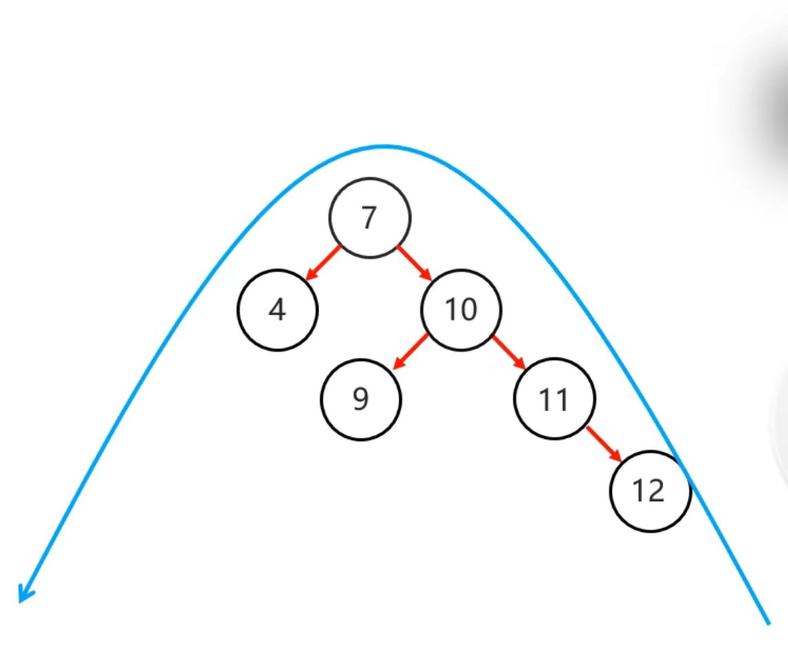


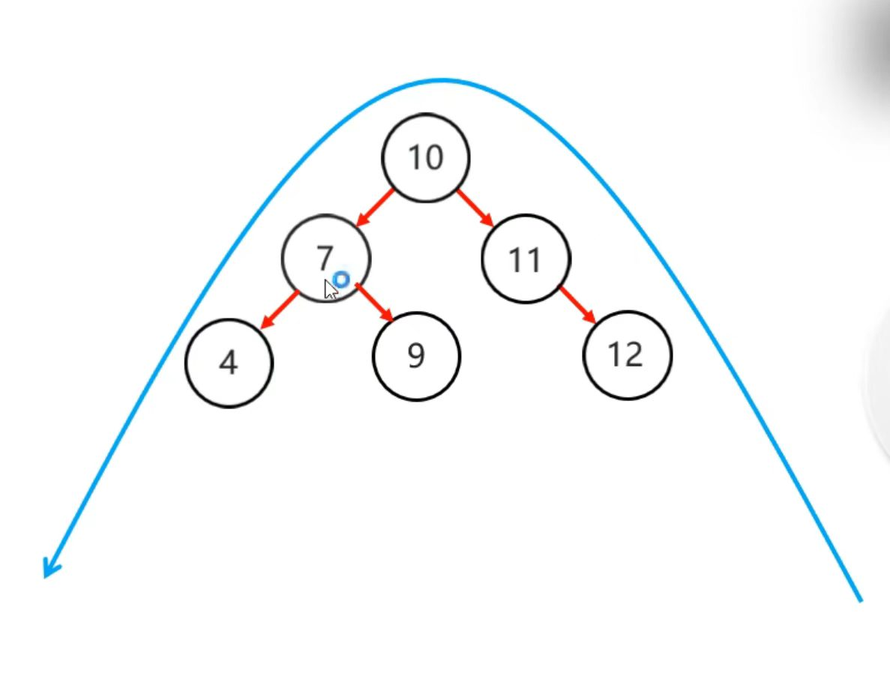


右旋（顺时针）：

* 简易版：
  * 以不平衡的点作为支点
  * 把支点右旋降级，变成右子节点
  * 晋升原来的左子节点
* 困难版：
  * 以不平衡的点作为支点
  * 把根节点的左侧往右拉
  * 原先的左子节点变成新的父节点，并把多余的右子节点出让，给已经降级的根节点当作左节点


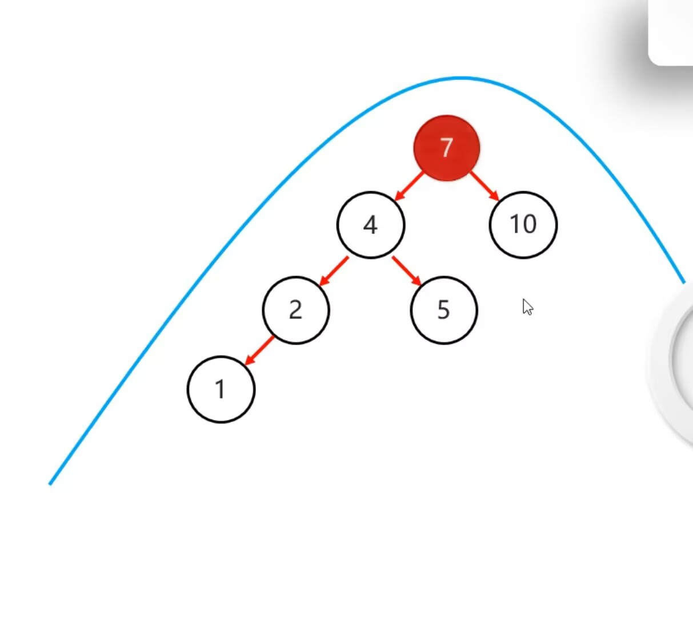


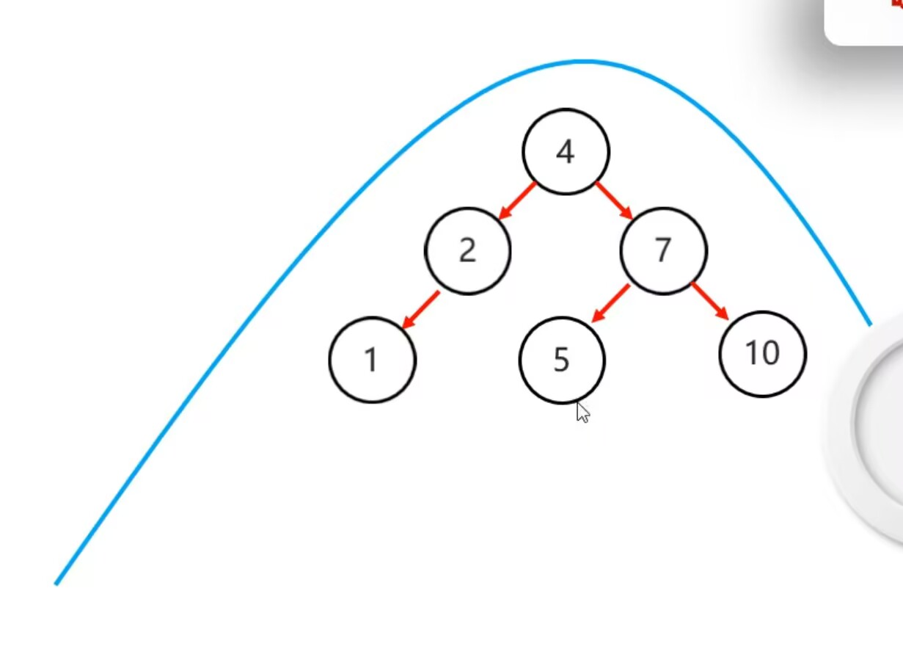


**需要旋转的四种情况：**

* **左左**：在根节点左子树的左子树有节点插入**（一次右旋搞定）**

  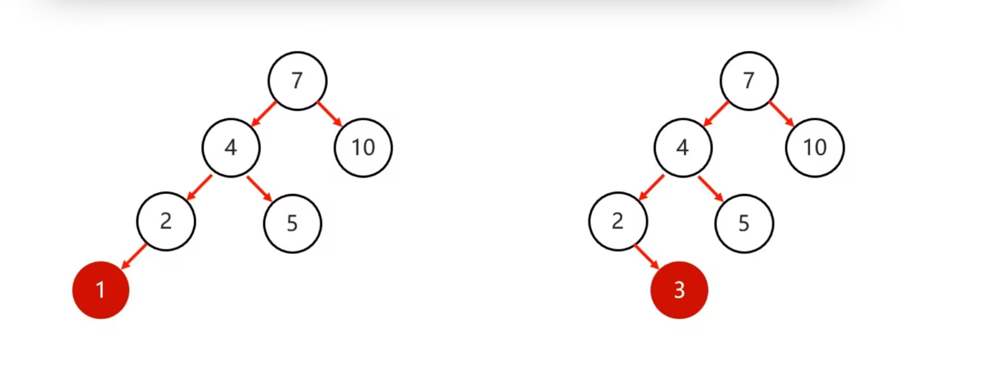


* **左右**：在根节点左子树的右子树有节点插入**（局部位置左旋，整体右旋）**


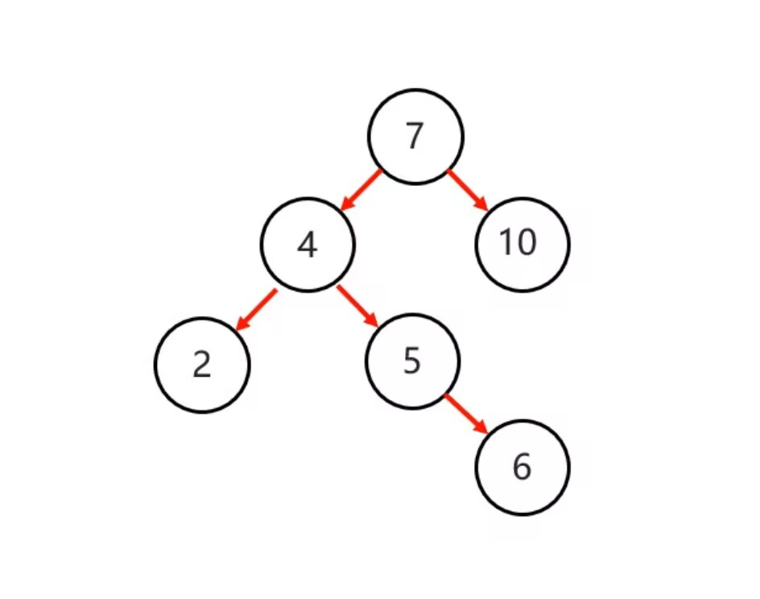

先进行一次局部的左旋，变成左左，

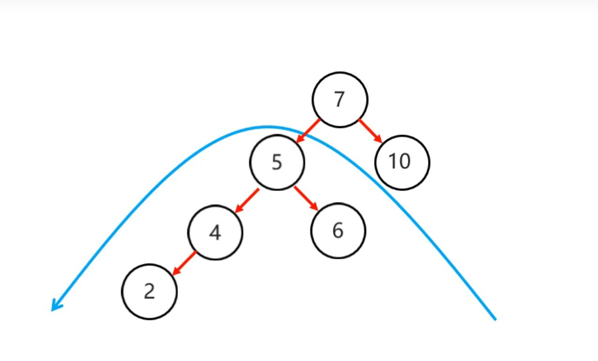


然后进行一次右旋：

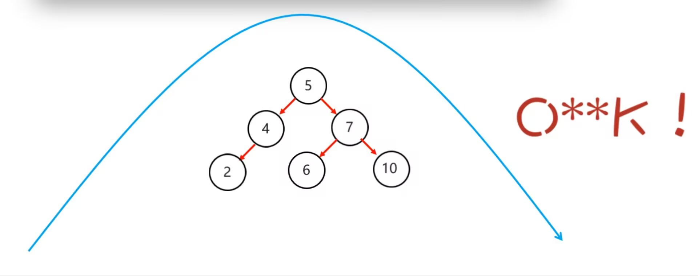


* **右右**：在根节点右子树的右子树有节点插入**（进行一次左旋）**


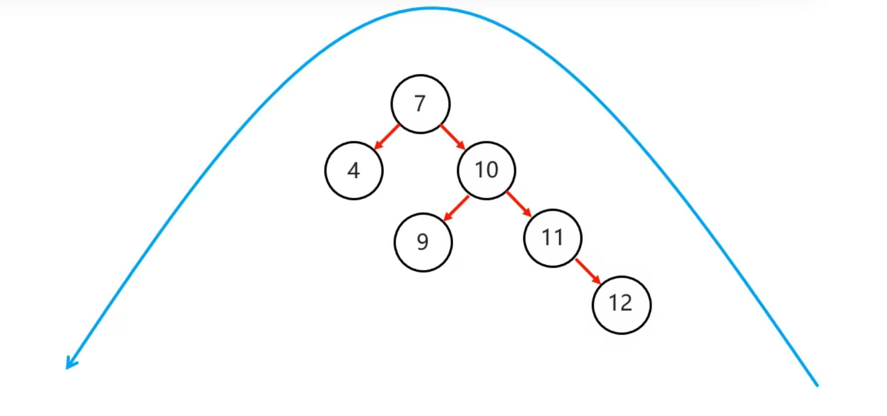

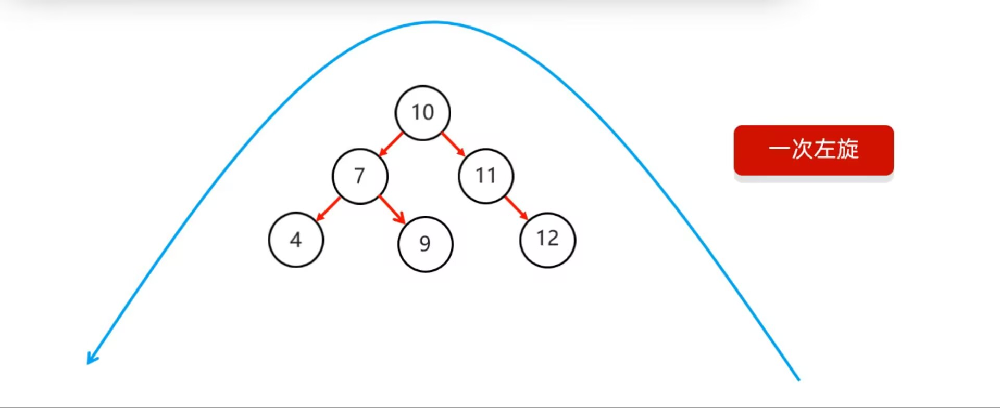


* **右左**：在根节点右子树的左子树有节点插入**（局部位置右旋，整体左旋）**


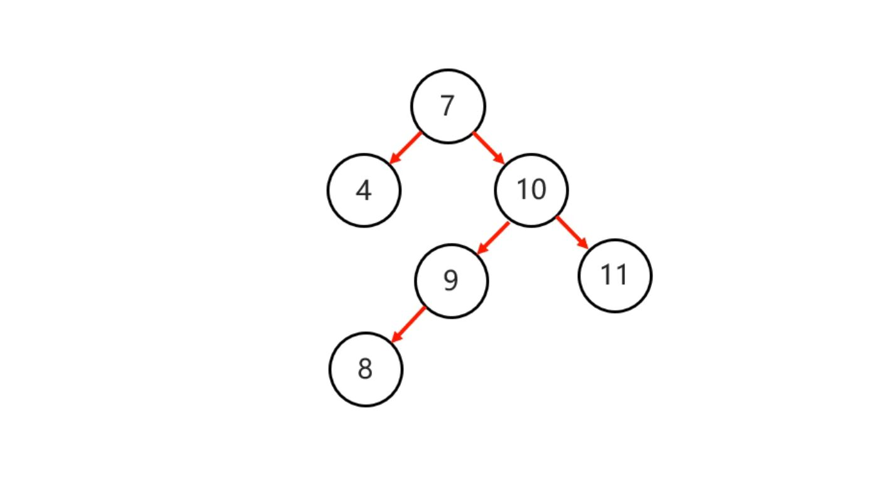


局部位置右旋：

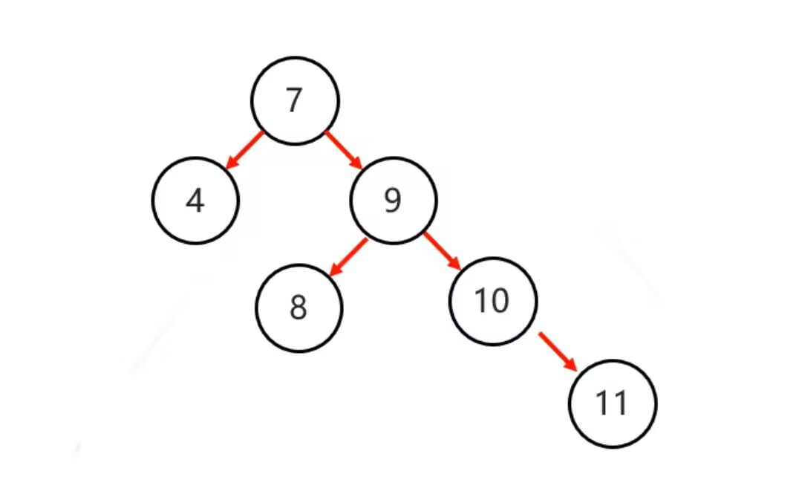


整体左旋：

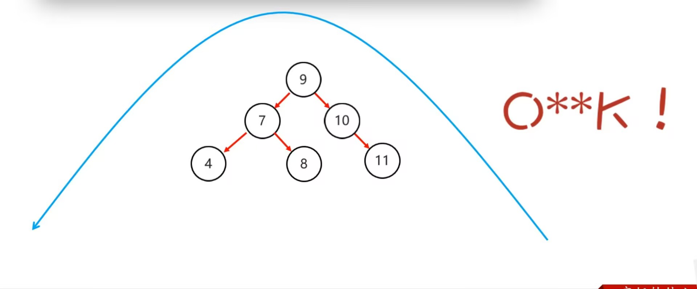


**需要旋转的四种情况：**

* **左左**：在根节点左子树的左子树有节点插入**（一次右旋搞定）**
* **左右**：在根节点左子树的右子树有节点插入**（局部位置左旋，整体右旋）**
* **右右**：在根节点右子树的右子树有节点插入**（进行一次左旋）**

* **右左**：在根节点右子树的左子树有节点插入**（局部位置右旋，整体左旋）**


**弊端：**

添加节点时，可能因为要旋转的次数太多了，造成时间的浪费


### 红黑树

平衡二叉B树，一种特殊的二叉查找树，并非高度平衡


**红黑规则：**

1. 每一个节点是红色/黑色
2. 根节点必须是黑色
3. 如果一个节点没有子节点/父节点，则该节点相应的指针属性值为Nil，这些Nil视为叶节点，每个叶节点（Nil）是黑色的
4. 不能出现两个红色节点相连
5. 对于每一个节点，从该节点到其后代叶节点的简单路径上，均包含相同数目的黑色节点


**添加规则：**

默认颜色：添加节点默认是红色的（效率高）


* **根节点：** 
  1.  直接变为黑色

* **非根：**
  * **父黑色：**
    1. 无需操作
  * **父红色：(三代考虑)**
    * **叔叔红色：** **（颜色交换，祖父判断）**
      1. 将父和叔设为黑色
      2. 将祖父改为红色
      3. 若祖父为根，再将根变为黑色
      4. 若祖父非根，将祖父设置为当前节点在进行其他判断
    * **叔叔黑色（当前节点为父的右孩子）：** **(父亲左旋，父亲判断)**
      1. 把父作为当前节点并左旋，再进行判断**（这里会转换成最后一种情况）**
    * **叔叔黑色（当前节点为父的左孩子）：** **(颜色交换，祖父右旋)**
      1. 将父设为黑色
      2. 将祖父设为红色
      3. 以祖父为支点进行右旋


# 泛型

## 概念

**泛型的好处：**

* 统一数据类型
* 把运行时期的问题提前到了编译期间，避免了强制类型转换可能出现的异常


**伪泛型**

* java中泛型是伪泛型，比如：一个String 进入集合后，其实java会将其转为Object,如果它要出去，java就会把它转回String


**细节**

* 只能写引用数据类型（包装类）
* 指定泛型的具体类型后，传递数据时，可以传入该类类型或其子类类型
  * 比如指定了Animal,我们可以传Cat，但一般不这样
* 如果不写泛型，默认为Object


**继承性**

泛型不具备继承性，但数据具备继承性

```java
package com.Vanilla.test3;

import java.util.ArrayList;

public class Test3 {
    public static void main(String[] args) {
        ArrayList<Ye> list1 = new ArrayList<>();
        ArrayList<Fu> list2 = new ArrayList<>();
        ArrayList<Zi> list3 = new ArrayList<>();

        method(list1);
        //method(list2);报错
        //method(list3);报错
        
        
        //数据具有继承性
        list1.add(new Ye());
        list1.add(new Fu());
    }
    
    public static void method(ArrayList<Ye> list){
    }
}

class Ye{}
class Fu extends Ye{}
class Zi extends Fu{}
```


**通配符**

* 本方法虽然不确定类型，但是我希望只能传递Ye,Fu,Zi
* 使用场景：
  * 限定类型的范围


* 不确定

```java
    public static void method(ArrayList<?> list){
    }
```


* 可以传递Ye 及其子类

```java
    public static void method(ArrayList<? extends Ye> list){
    }
```


* 可以传递Ye 及其父类

```java
    public static void method(ArrayList<? super Ye> list){
    }
```


## 泛型类

在类后面加 < >

* 使用场景：当一个类中，某个变量的数据类型不确定时，就可以定义带有泛型的类

* 格式：

  ```java
  public class Test <E>{
  }
  ```

  此处的E可以理解为变量，就是待记录的数据类型，还可以写成：T,E,K,V...   （与cpp的Template有点像）


## 泛型方法

* 方法中形参的类型不确定
  * 使用类名后面定义的泛型
  * 在方法后面定义泛型
* 格式：

```java
public static <E> void addAll(ArrayList<E> list,E e){}

//调用时：
ArrayList<String> list =new ArrayList<>();
listUtill.addAll(list,"aaa");//当我们传list时,E就已经被确定了
```


## 泛型接口

```java
public interface Test <E>{
}
```


**使用**

1. 实现类给出具体的类型

   ```java
   public class Test2 implements List <String>{}
   ```

   

2. 实现类延续泛型，创建对象时再确定

```java
public class Test2<E> implements List <E>{}
```


# Stream流

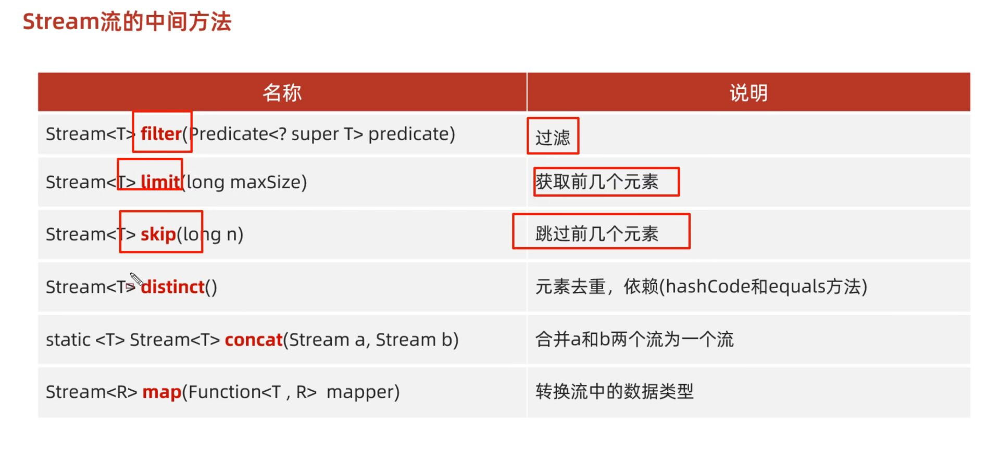


### 中间用法

```java
list.stream().filter(s->s.startWith("张").forEach(s->System.out.println(s););
list.stream().skip(3).limit(3).forEach(s->System.out.println(s););
Stream.concat(list1.stream(),list2.stream()).forEach(s->System.out.println(s););         
                                        
```


### 终结用法

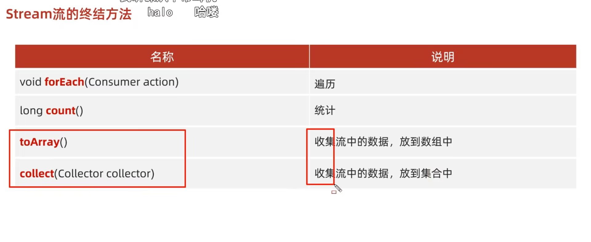


```java
     //收集，此处可改为Set
		List<String> newList1=list.stream()
                .filter(s->"男".equals(s.split("-")[1]))
                .collect(Collectors.toList());
```


```java
List<Integer> newlist = list.stream()
    .filter(n -> n % 2 == 0)
    .collect(collectors.tolist());
```


```java
        Map<String, Integer> map = list.stream()
                .filter(s -> Integer.parseInt(s.split(regex: ",")[1]) >= 24)
                .collect(collectors.toMap(
                s -> s.split(regex:",")[0],
                s -> Integer.parseInt(s.split(regex: ",")[1])));
```


# 异常


```java
try{
    ...
}catch(NumberFormatException e){
    ...
}catch(RuntimeException e){
    ...
}
```


# io流

```java
public class demo1 {
    public static void main(String[] args) throws IOException {
        FileOutputStream fos = new FileOutputStream("io\\b.txt");//路径名
        fos.write(98);
        fos.close();
    }
}

```


# 多线程


# 反射


